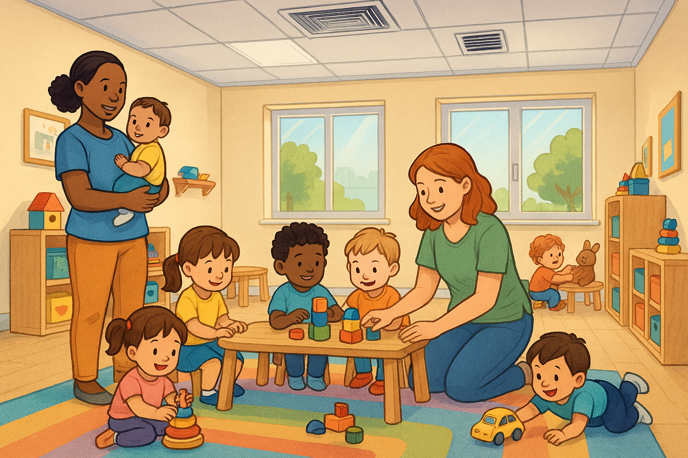
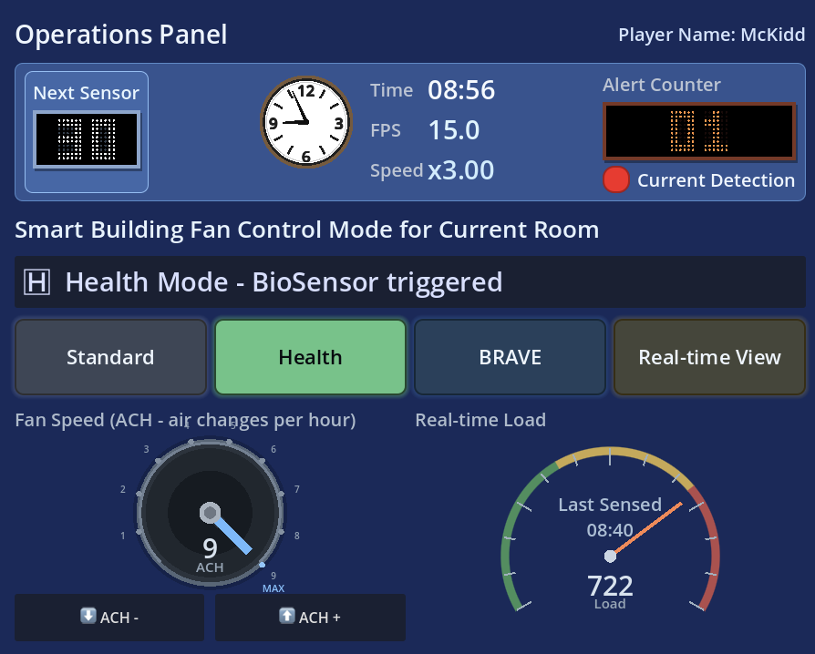
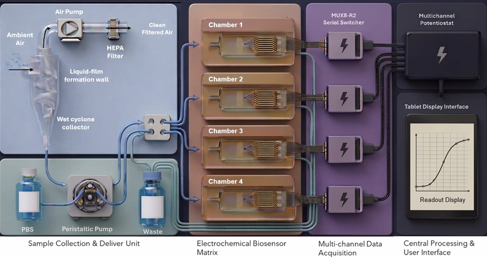
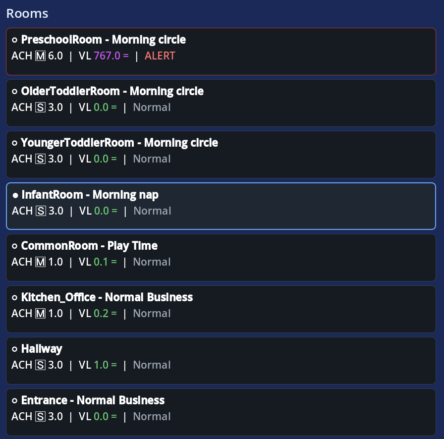
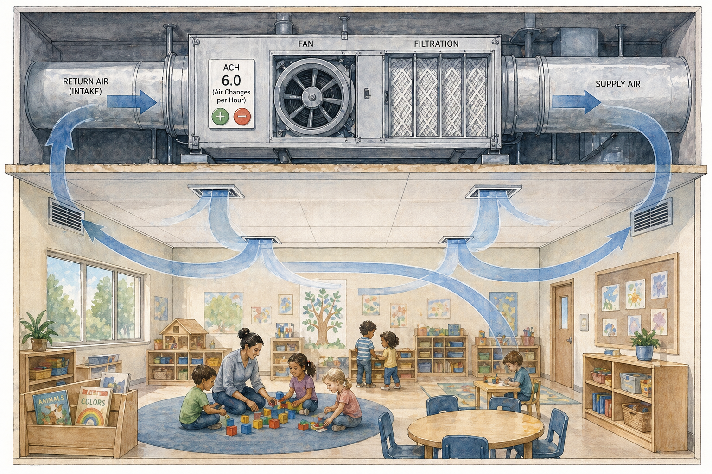
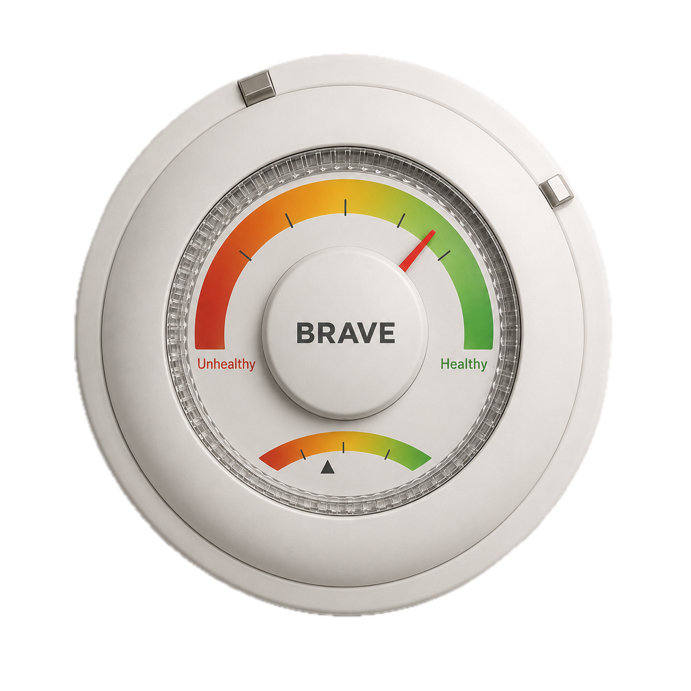
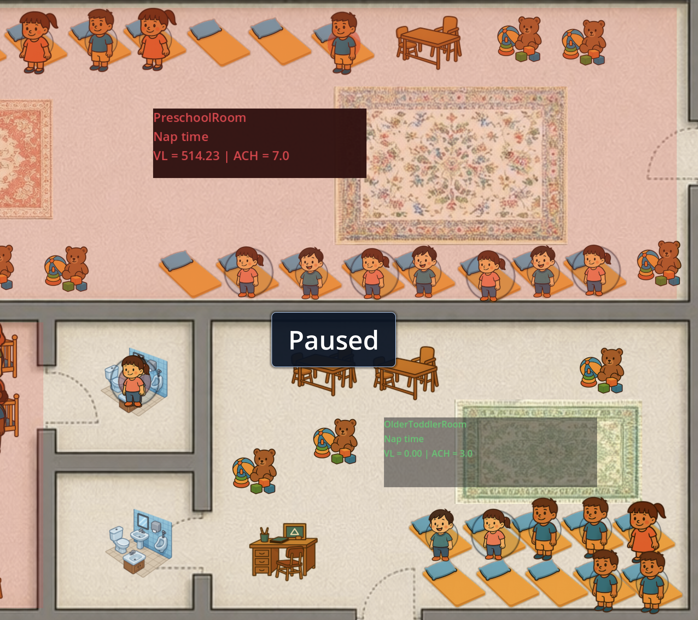
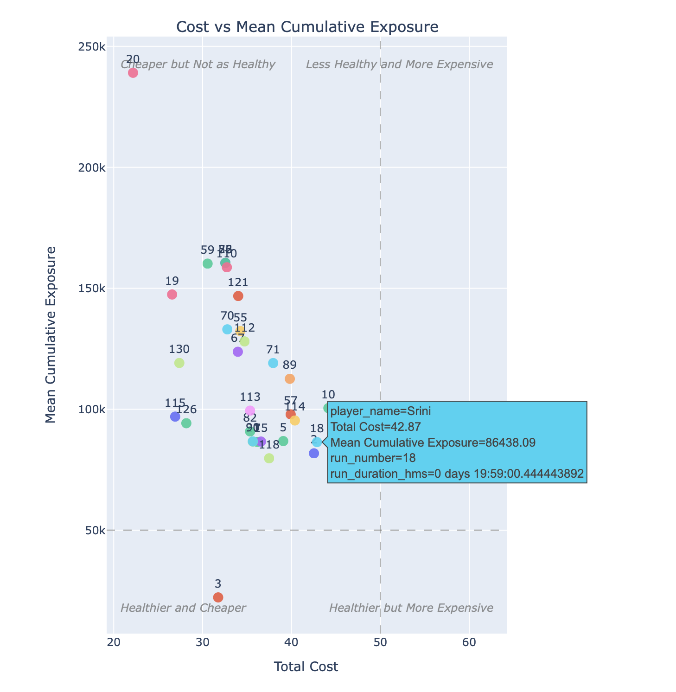

# BRAVE Childcare Tutorial

This document mirrors the in-game tutorial card sequence in a readable markdown format.

## How to Use This Guide

- Follow steps in order for a first-time run.
- Keep the right-side panel visible during play.
- Compare these instructions with in-game prompts when validating tutorial edits.

## Step 1: Welcome

**Message**
This game focuses on how well you can manage the building air-handling controls to maintain a healthy environment.

**Image**

## Step 2: Main Objective and Operations Hub

**Title**
You need to control room air-cleaning rates to keep high loads at bay.

**Message**
Keep load levels low while balancing fan-speed cost. The right panel is the operations hub.

**UI Targets**
- PanelViralLoadGauge
- PanelAchGauge

**Image**

## Step 3: BioSensor Alerts

**Title**
BRAVE biosensor can sense pathogens.

**Message**
The biosensor reads periodically and triggers alerts when unhealthy pathogen loads are detected.

**UI Targets**
- PanelAlertCountMatrix
- SensorCountdownCard

**Image**

## Step 4: Room Cards and Navigation

**Title**
Fifty people and 8 rooms are a lot to manage.

**Message**
Each room card shows ACH, alert status, and recent load trend. Toggle rooms with E/R or controller equivalents. Enable BRAVE and Realtime View (V) for live values.

**UI Targets**
- PanelRoomCards

**Image**

## Step 5: ACH Controls

**Title**
Air Changes per Hour (ACH) is how often room air is filtered.

**Message**
Raise or lower ACH to improve air quality while managing operating cost.

**UI Targets**
- PanelAchDownButton
- PanelAchUpButton

**Image**

## Step 6: Health Mode Automation

**Title**
BRAVE goal is to automate this process.

**Message**
Health Mode demonstrates automatic ACH adjustments based on room conditions.

**UI Targets**
- PanelHealthToggleButton

**Image**

## Step 7: Speed, Pause, and Camera

**Title**
You control speed and can pause to inspect the simulation.

**Message**
Use pause, speed controls, zoom, and camera pan to inspect conditions and decision effects.

**UI Targets**
- SensorCountdownCard
- PanelSpeedDownButton
- PanelSpeedUpButton
- PanelPauseButton
- EndSimulationButton

**Image**

## Step 8: Compare Against Other Players

**Title**
See how well you do versus other players.

**Message**
After completing the day, review run dynamics and leaderboard comparisons.

**UI Targets**
- EndSimulationButton

**Image**

## Notes for Maintainers

- Source of truth for in-game tutorial card content: inputs/tutorial_steps.json
- Runtime loading and fallback logic: Entity/main.gd
- If this markdown guide is updated, keep it aligned with the JSON tutorial content.
